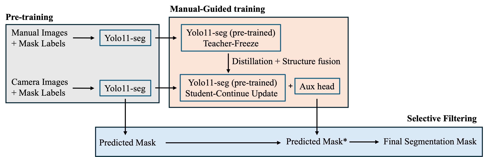
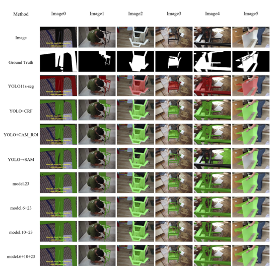
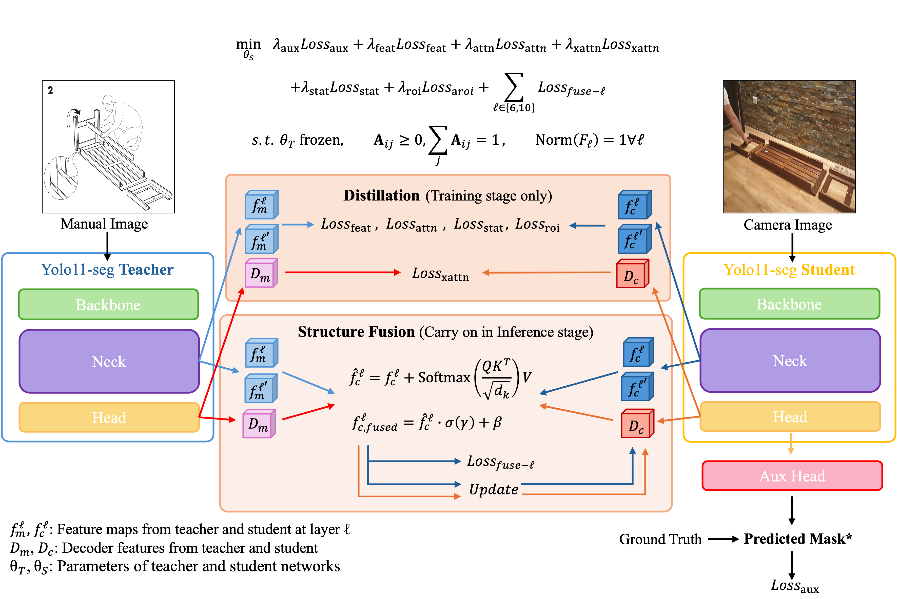

# MAPS: Manual-Guided Assembly-Part Segmentation

**MAPS** is a manual-guided vision framework for segmenting assembly parts under clutter and occlusion. It combines a camera image with the aligned 2D assembly-manual step as structural guidance, without requiring CAD or depth at deployment.

**Paper:** Chia Ying Kuo and Sheng Jen Hsieh, *Design and evaluation of an assembly part segmentation framework using 2D structural guidance for robotic manipulation in confined workspaces*, **The International Journal of Advanced Manufacturing Technology**, 2026.  
https://doi.org/10.1007/s00170-026-18468-w

> **Code status.** This repository is a cleaned research-code companion to the published paper. The public-facing interfaces were extracted from the experimental workflow for readability and reuse. Model weights and third-party data are not distributed here.

## What MAPS does

- Uses a **YOLO11s-seg camera/student branch** together with a **frozen manual/teacher branch**.
- Injects manual-derived structural guidance through feature fusion and an auxiliary mask prior.
- Uses that prior to filter and refine camera-view instance masks rather than replacing the detector output.
- Operates from 2D camera and manual inputs without requiring CAD or depth at deployment.
- Was evaluated on **IKEA-Manuals-at-Work** assembly scenes.

### Results reported in the paper

Relative to the camera-only baseline, the paper reports:

- **+10.4% Dice**
- **+16.7% IoU**
- **BoundaryF: 0.3043 → 0.5815**

These numbers are publication results, not newly reproduced measurements from the cleaned repository.

## Method overview

<p align="center">
  
</p>

<p align="center">
  <em>End-to-end MAPS workflow. A frozen manual-image teacher provides structural guidance to the camera-image student through distillation, structure fusion, and an auxiliary mask head.</em>
</p>

## Qualitative results

<p align="center">
  
</p>

<p align="center">
  <em>Representative visual comparisons from the published study across the camera-only YOLO11s-seg baseline, post-processing and SAM-based baselines, and the evaluated MAPS fusion configurations.</em>
</p>

The examples highlight segmentation behavior across multiple assembly scenes with clutter, occlusion, and varying object visibility. For the full quantitative analysis and experimental protocol, refer to the paper.

## Architecture details

<p align="center">
  
</p>

<p align="center">
  <em>Detailed teacher-student architecture. Distillation is used during training, while structure fusion and the auxiliary segmentation path provide manual-derived structural guidance that carries into inference.</em>
</p>

## Repository structure

```text
maps/                 Reusable MAPS modules
training/             Clean one-configuration training interface
evaluation/           Single-pair inference and dataset evaluation
data/                 Dataset preparation utilities
baselines/            Camera-only and comparison baselines
assets/               Figures for the paper companion
tests/                Lightweight import/CLI/metric checks
train_test_code/      Original training engine retained for research parity
```

## Installation

```bash
python -m venv .venv
source .venv/bin/activate
pip install -r requirements.txt
```

For the comparison baselines:

```bash
pip install -r requirements-baselines.txt
```

PyTorch/CUDA installation may need to be adjusted for the target GPU environment.

## Data

The dataset is **not redistributed** in this repository. Obtain IKEA-Manuals-at-Work from its official source and follow its license. See [`THIRD_PARTY_DATA.md`](THIRD_PARTY_DATA.md).

A prepared fold uses paired camera/manual images and camera-view RLE masks, for example:

```text
fold3/
├── train/
│   ├── images/camera/
│   ├── images/manual/
│   └── mask_labels/camera/
└── val/
    ├── images/camera/
    ├── images/manual/
    └── mask_labels/camera/
```

## Training

The ablation study included five configurations, each trained for **100 epochs**:

```text
base
fuse_10_aux
fuse_6_10_aux
fuse_6_aux
fuse_aux_only
```

Run one configuration on one prepared fold:

```bash
python training/train.py \
  --config training/config.yaml \
  --ablation fuse_aux_only \
  --fold-root /path/to/fold3 \
  --out-dir runs/fold3/fuse_aux_only
```

## Inference

Run MAPS on one camera/manual pair:

```bash
python evaluation/run_inference.py \
  --ckpt /path/to/ckpt_epoch_100.pt \
  --student /path/to/student.pt \
  --teacher /path/to/teacher.pt \
  --camera /path/to/camera.jpg \
  --manual /path/to/manual.jpg \
  --out-dir outputs/example \
  --device 0
```

## Dataset evaluation

```bash
python evaluation/evaluate.py \
  --ckpt /path/to/ckpt_epoch_100.pt \
  --student /path/to/student.pt \
  --teacher /path/to/teacher.pt \
  --test-cam-yaml /path/to/camera.yaml \
  --test-man-yaml /path/to/manual.yaml \
  --test-mask-root /path/to/mask_labels/test/camera \
  --out-dir outputs/evaluation \
  --save-masks
```

The evaluation interface includes Dice, IoU, Precision, Recall, BoundaryF, AP50, and mAP50-95 reporting.

## Baselines

`baselines/` contains compact implementations of the main comparison concepts:

- `camera_only.py` — camera-only YOLO11-seg.
- `manual_roi_sam.py` — manual-derived ROI boxes used as SAM prompts.
- `sam_box_from_yolo.py` — YOLO detections used as SAM box prompts.
- `direct_fusion.py` — learnable camera/manual feature fusion without the frozen-teacher/distillation setup.


## Reproducibility scope

This is a **research-code release**, not a turnkey reproduction environment. The repository preserves the core method, training configuration interface, inference path, evaluation utilities, and comparison baselines while removing local cluster paths and exploratory experiment infrastructure. Users reproducing or extending the work should expect to adapt dataset locations, model weights, CUDA/PyTorch versions, and environment-specific details.

For authoritative experimental settings and reported results, refer to the published paper.

## Citation

```bibtex
@article{kuo2026maps,
  title   = {Design and evaluation of an assembly part segmentation framework using 2D structural guidance for robotic manipulation in confined workspaces},
  author  = {Kuo, Chia Ying and Hsieh, Sheng Jen},
  journal = {The International Journal of Advanced Manufacturing Technology},
  year    = {2026},
  doi     = {10.1007/s00170-026-18468-w}
}
```

## License

- **Project code:** GNU Affero General Public License v3.0 (`AGPL-3.0-only`); see [`LICENSE`](LICENSE).
- **Third-party software/dependencies:** remain subject to their respective licenses.
- **Dataset:** not redistributed; see [`THIRD_PARTY_DATA.md`](THIRD_PARTY_DATA.md) and the dataset provider's terms.
- **Model weights:** not redistributed and are not licensed by this repository unless explicitly stated otherwise.
