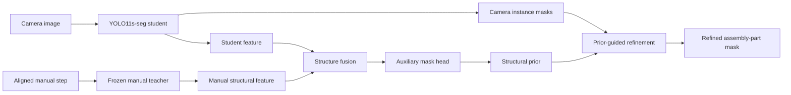

# MAPS: Manual-Guided Assembly-Part Segmentation

**MAPS** is a manual-guided vision framework for segmenting assembly parts under clutter and occlusion. It uses a camera image together with the aligned 2D assembly-manual step as structural guidance, without requiring CAD or depth at deployment.

**Paper:** Chia Ying Kuo and Sheng Jen Hsieh, *Design and evaluation of an assembly part segmentation framework using 2D structural guidance for robotic manipulation in confined workspaces*, **The International Journal of Advanced Manufacturing Technology**, 2026.  
https://doi.org/10.1007/s00170-026-18468-w

## Highlights

- YOLO11s-seg camera/student branch with a frozen manual/teacher branch.
- Manual features provide structural guidance through feature fusion and an auxiliary mask prior.
- The auxiliary prior filters/refines camera-view instance masks rather than replacing the detector output.
- Evaluated on IKEA-Manuals-at-Work assembly scenes.
- Reported against the camera-only baseline in the paper: **+10.4% Dice**, **+16.7% IoU**, and BoundaryF **0.3043 → 0.5815**.



## Repository structure

```text
maps/                 Reusable MAPS modules
training/             Clean one-configuration training interface
evaluation/           Single-pair inference and dataset evaluation
data/                 Dataset preparation utilities
baselines/             Camera-only and comparison baselines
assets/                User-owned figures for the paper companion
tests/                 Lightweight import/CLI/metric checks
```

The original experiment-oriented training engine is temporarily retained under `train_test_code/` so the cleaned training interface can be verified against the HPRC workflow before the final public release. Exploratory k-fold and evaluation drivers are not part of the intended public interface.

## Installation

```bash
python -m venv .venv
source .venv/bin/activate
pip install -r requirements.txt
```

For the SAM comparison baselines:

```bash
pip install -r requirements-baselines.txt
```

PyTorch/CUDA installation can be adjusted to match the target GPU environment.

## Data

The dataset is **not redistributed** in this repository. Obtain IKEA-Manuals-at-Work from its official source and follow its license. See [`THIRD_PARTY_DATA.md`](THIRD_PARTY_DATA.md).

The prepared MAPS layout uses paired camera/manual images and camera-view RLE masks, for example:

```text
fold3/
├── train/
│   ├── images/camera/
│   ├── images/manual/
│   └── mask_labels/camera/
└── val/
    ├── images/camera/
    ├── images/manual/
    └── mask_labels/camera/
```

## Training

The study trained five configurations for **100 epochs each**:

```text
base
fuse_10_aux
fuse_6_10_aux
fuse_6_aux
fuse_aux_only
```

Run one configuration on one prepared fold:

```bash
python training/train.py \
  --config training/config.yaml \
  --ablation fuse_aux_only \
  --fold-root /path/to/fold3 \
  --out-dir runs/fold3/fuse_aux_only
```

Edit only the model/example paths in `training/config.yaml`; the public config contains no machine-specific HPRC paths.

## Inference

Run MAPS on one camera/manual pair:

```bash
python evaluation/run_inference.py \
  --ckpt /path/to/ckpt_epoch_100.pt \
  --student /path/to/student.pt \
  --teacher /path/to/teacher.pt \
  --camera /path/to/camera.jpg \
  --manual /path/to/manual.jpg \
  --out-dir outputs/example \
  --device 0
```

The cleaned inference path reconstructs the fusion and auxiliary head from checkpoint metadata, obtains the camera/student and manual/teacher features, builds the structural prior, and saves the refined segmentation mask.

## Dataset evaluation

```bash
python evaluation/evaluate.py \
  --ckpt /path/to/ckpt_epoch_100.pt \
  --student /path/to/student.pt \
  --teacher /path/to/teacher.pt \
  --test-cam-yaml /path/to/camera.yaml \
  --test-man-yaml /path/to/manual.yaml \
  --test-mask-root /path/to/mask_labels/test/camera \
  --out-dir outputs/evaluation \
  --save-masks
```

The evaluator reports per-image and aggregate Dice, IoU, Precision, Recall, BoundaryF, AP50, and mAP50-95.

## Baselines

`baselines/` contains compact implementations of the main comparison concepts:

- `camera_only.py` — camera-only YOLO11-seg.
- `manual_roi_sam.py` — manual-derived ROI boxes used as SAM prompts.
- `sam_box_from_yolo.py` — YOLO detections used as SAM box prompts.
- `direct_fusion.py` — learnable camera/manual feature fusion without the frozen-teacher/distillation setup.

These files intentionally omit the old machine-specific experiment orchestration.

## Notes on reproducibility

Model weights are not included. The training and inference interfaces accept model/checkpoint paths explicitly. Before public release, the cleaned branch should be run once on HPRC to confirm parity with the original research workflow and checkpoint format.

## Citation

```bibtex
@article{kuo2026maps,
  title   = {Design and evaluation of an assembly part segmentation framework using 2D structural guidance for robotic manipulation in confined workspaces},
  author  = {Kuo, Chia Ying and Hsieh, Sheng Jen},
  journal = {The International Journal of Advanced Manufacturing Technology},
  year    = {2026},
  doi     = {10.1007/s00170-026-18468-w}
}
```

## License

- **Code:** Apache-2.0; see [`LICENSE`](LICENSE).
- **Data:** not included; see [`THIRD_PARTY_DATA.md`](THIRD_PARTY_DATA.md).
